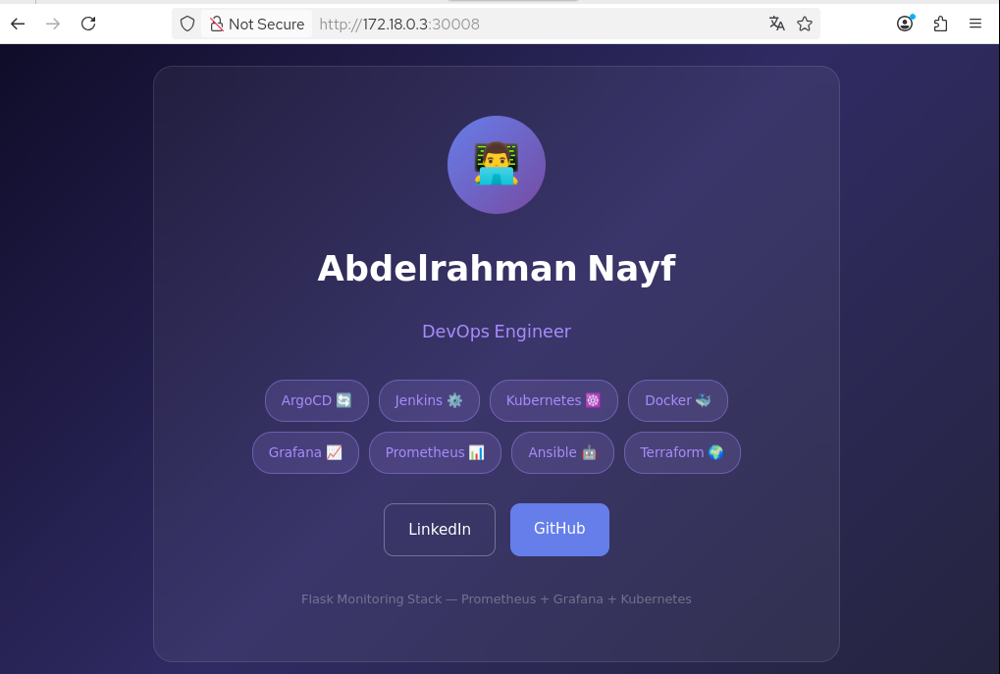
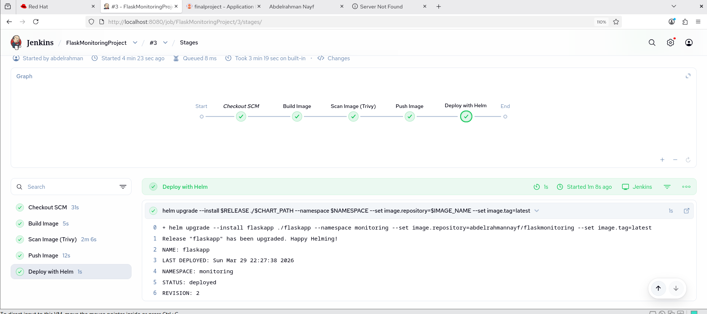
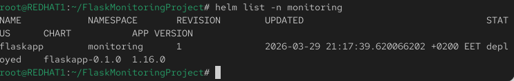
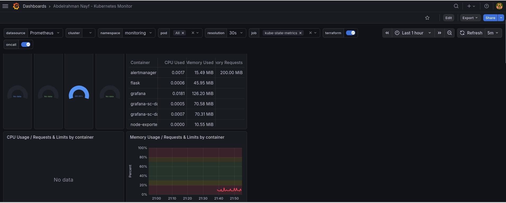

# 📊 Flask Monitoring Stack

A production-grade DevOps project featuring a Flask application with full CI/CD pipeline, container optimization, Kubernetes deployment via Helm, and real-time monitoring with Prometheus & Grafana.

---

## 🏗️ Architecture

```
Developer
    │
    │ git push
    ▼
┌─────────────────┐
│     GitHub      │
└────────┬────────┘
         │ trigger
         ▼
┌─────────────────────────────────┐
│         Jenkins (CI/CD)         │
│                                 │
│  1. Build Docker Image          │
│  2. Scan with Trivy             │
│  3. Push to DockerHub           │
│  4. Deploy with Helm            │
└────────┬────────────────────────┘
         │
    ┌────┴────┐
    ▼         ▼
┌────────┐  ┌─────────────────────────┐
│Docker  │  │    Kubernetes Cluster   │
│  Hub   │  │  ┌──────────────────┐   │
└────────┘  │  │ namespace:       │   │
            │  │   monitoring     │   │
            │  │                  │   │
            │  │  flask-app x2   │   │
            │  │  Helm managed   │   │
            │  └──────────────────┘   │
            │                         │
            │  ┌──────────────────┐   │
            │  │   Prometheus     │   │
            │  │  collects metrics│   │
            │  └────────┬─────────┘   │
            │           │             │
            │  ┌────────▼─────────┐   │
            │  │     Grafana      │   │
            │  │  Dashboard 📊    │   │
            │  └──────────────────┘   │
            └─────────────────────────┘
```

---

## 🛠️ Tech Stack

| Category | Tool |
|---|---|
| Application | Flask + Python |
| Containerization | Docker Multi-stage |
| Container Registry | DockerHub |
| Orchestration | Kubernetes (Kind) |
| Package Manager | Helm |
| CI/CD | Jenkins |
| Security Scanning | Trivy |
| Metrics Collection | Prometheus |
| Monitoring Dashboard | Grafana |

---

## 📁 Project Structure

```
FlaskMonitoringProject/
├── app/                        # Flask Application
│   ├── app.py                  # Main app + Prometheus metrics
│   ├── requirements.txt
│   └── templates/
│       └── index.html          # Personal portfolio page
│
├── flaskapp/                   # Helm Chart
│   ├── Chart.yaml
│   ├── values.yaml
│   └── templates/
│       ├── deployment.yaml
│       └── service.yaml
│
├── Dockerfile                  # Multi-stage build
└── Jenkinsfile                 # CI/CD Pipeline
```

---

## ✨ Key Features

### 🐳 Multi-stage Docker Build
Reduced image size from **1.5GB → 186MB** using multi-stage builds:

```dockerfile
# Stage 1: Build dependencies
FROM python:3.10-slim AS builder
RUN pip install --user -r requirements.txt

# Stage 2: Clean final image
FROM python:3.10-slim
COPY --from=builder /root/.local /root/.local
COPY app/ .
```

### ⎈ Helm Charts
Deploy and upgrade with a single command:

```bash
helm upgrade --install flaskapp ./flaskapp -n monitoring
```

### 📊 Prometheus Metrics
Built-in `/metrics` endpoint exposing:
- Request count per endpoint
- Request latency histogram

### 📈 Grafana Dashboard
Real-time visualization of:
- CPU & Memory usage per container
- Pod status across namespace
- Resource requests vs limits

---

## 🚀 Setup & Deployment

### Prerequisites
- Docker
- Kubernetes cluster (Kind)
- Helm 3
- Jenkins
- kubectl

---

### 1️⃣ Clone Repository

```bash
git clone https://github.com/abdelrahmannayf/FlaskMonitoringProject.git
cd FlaskMonitoringProject
```

---

### 2️⃣ Build Docker Image

```bash
docker build -t abdelrahmannayf/flaskmonitoring:latest .
docker push abdelrahmannayf/flaskmonitoring:latest
```

---

### 3️⃣ Deploy with Helm

```bash
kubectl create namespace monitoring
helm install flaskapp ./flaskapp -n monitoring
kubectl get pods -n monitoring
```

---

### 4️⃣ Install Prometheus & Grafana

```bash
helm repo add prometheus-community https://prometheus-community.github.io/helm-charts
helm repo update
helm install prometheus prometheus-community/kube-prometheus-stack -n monitoring
```

---

### 5️⃣ Access Grafana Dashboard

```bash
kubectl port-forward svc/prometheus-grafana -n monitoring 3000:80
```

Open: `http://localhost:3000`

Import Dashboard ID: **15760**

---

### 6️⃣ Access the Application

```bash
kubectl get svc -n monitoring
curl http://NODE_IP:30008
```

---

## 🔄 CI/CD Pipeline

```
1. Push code to GitHub
        ↓
2. Jenkins detects change
        ↓
3. Build Docker image (Multi-stage)
        ↓
4. Trivy scans for vulnerabilities
        ↓
5. Push image to DockerHub
        ↓
6. Helm upgrades deployment on Kubernetes
        ↓
7. Grafana monitors new deployment ✅
```

---

## 🔐 Jenkins Credentials Required

| ID | Type | Used In |
|---|---|---|
| `dockerhub-cred` | Username/Password | Push image |

---

## 👤 Author

**Abdelrahman Nayf**

- 🐙 GitHub: [@abdelrahmannayf](https://github.com/abdelrahmannayf)
- 💼 LinkedIn: [abdelrahman-nayf](https://www.linkedin.com/in/abdelrahman-nayf-b0a365214)
- 📧 Email: abdelrahmannayf@gmail.com
